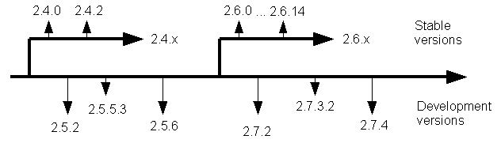

Introduction to WinMerge
----

WinMerge is an [Open Source](http://www.opensource.org/) differencing and merging tool for Windows. WinMerge can compare both folders and files, presenting differences in a visual text format that is easy to understand and handle.

WinMerge is highly useful for determining what has changed between project versions, and then merging changes between versions. WinMerge can be used as an external differencing/merging tool or as a standalone   application.

In addition, WinMerge has many helpful supporting features that make comparing, synchronising, and merging as easy and useful as possible. Several programming languages and other file formats are syntax-highlighted.

WinMerge is not a hex editor. WinMerge can show binary files contents and differences between them. But the information is meant for viewing only: editing binary files with WinMerge can break the files.

The goal of WinMerge development is to make comparing, synchronizing, and merging folders and files easy and fast, while maintaining maximum reliability. Ease of use is of key importance for reducing errors. The latest version, 2.16.0, is considered a stable and reliable program to use.

Please note that WinMerge is not freeware (as many sites on the Web have stated): it is [GPL](http://www.gnu.org/licenses/gpl-2.0.html) licensed. We provide you with a good tool for free, so please honor your license agreement and submit improvements to us. We are happy to get help improving WinMerge, to the advantage of all WinMerge users.

### 1. WinMerge versions

There are three kind of versions available in the [downloads](http://sourceforge.net/projects/winmerge/files/) page.

#### 1.1 Stable versions

[Stable versions](http://sourceforge.net/projects/winmerge/files/stable/) are recommended for most users. If you are unsure about what version to use, use the latest stable version. Stable versions have an even second number, for example, 2.4, 2.6 and 2.8.

#### 1.2 Beta versions

[Beta versions](http://sourceforge.net/projects/winmerge/files/beta/) are for people who want to test latest features and improvements made after last stable version. Beta versions are not tested as extensively as stable versions and probably have some bugs. Beta versions have an odd second number, for example 2.5 and 2.7. Beta versions can be used in production, because they are not expected to have major bugs. But there is always a risk with using beta-level releases, so       consider it carefully. We have tried to release a new stable series once a year, so it may be worth waiting for few months for the next stable release...

#### 1.3 Experimental versions

[Experimental versions](http://sourceforge.net/projects/winmerge/files/alpha/) or alpha versions are snapshot releases from our version control system (Subversion). They have all the latest features and improvements. Some features may still be buggy or incomplete. These releases are made available to allow users to try out the current code without needing to compile, and to participate in development discussions concerning new and changing features. We also appreciate any help testing the current code. Use experimental versions with care and enable backups! And please [report bugs](http://sourceforge.net/p/winmerge/bugs/) that you find while using these builds: it really helps with WinMerge development!

#### 1.4 Version tree

All this talk about different versions might be confusing if you never have worked with this kind of model. Lets illustrate with a picture:

WinMerge stable and development versions

The preceding diagram shows the relationships between different releases and versions. Development always happens within experimental and beta development versions. At the appropriate points we create new branches for stable releases. In the diagram, the arrows for 2.4.x and 2.6.x versions are two current stable branches. (The diagram is a snapshot; it is not updated to show the current stable branch).
      
**Important**   A branch always indicates a separate development effort. There is no any automation to copy improvements or fixes from development versions to stable versions, or in the opposite direction. Changes are always selected by hand and then merged (using WinMerge, of course).
        
After a branch is created, we try to keep the code in it as stable as possible. Usually this means that we copy only tested bug fixes from development versions to stable versions. Unfortunately this is not always an easy task, and errors can occur. New bugs can also appear in stable versions: this is real-life software development. However, in general, quality increases in branches. For example, 2.6.14 was a better release than 2.4.0. So we always recommend using the latest stable branch release.

This branching also means that stable versions don't get many new features after a branch is created. Stable versions 2.6.0 and 2.6.14 had pretty similar features. After the 2.6 stable branch, we created a new stable branch, 2.8, where we added many improvements and fixes.

 Many software vendors always increase their version numbers and advise people to use the version with the biggest number. If WinMerge were developed as proprietary software, users would see only versions from stable branches. But because WinMerge is an open source software project,  we want to keep our development as open as possible and to release many development versions. The latest development version can have version  number 2.9.1.0 and the latest stable version can be version 2.6.14.

### 1.2 Getting support and reporting bugs

The [Open Discussion forum](http://forums.winmerge.org/viewforum.php?f=4) is the fastest way to get help. Please be patient, it may take some time for somebody to answer.

If you find a bug, please submit it as a [bug report](http://sourceforge.net/p/winmerge/bugs/). Please attach as much information as you can: at a minimum, the version number of WinMerge that you are using. If you can, also attach a configuration log which, you can display by clicking *Help &rarr; Configuration* in the WinMerge window. Good information in a bug report makes it more likely that your bug will be fixed quickly.</para>

>  &nbsp;  **Important**  Include the version number in bug reports. You can check the version number by clicking *Help&nbsp;&rarr;&nbsp;About&nbsp;WinMerge*.

You must [register with SourceForge.net](https://sourceforge.net/account/registration/) before posting a bug report (registration is free). We require registering because anonymous submissions caused a lot of spam and also because there were no possibility to contact people for asking more information. We rarely sent direct emails but you'll get notifications when we ask questions in the bug item.

### 3. WinMerge source code and development

WinMerge source code is available in the [downloads](http://sourceforge.net/projects/winmerge/files/) page and from the [public Subversion server](http://sourceforge.net/p/winmerge/code/). Anyone can download the sources, study them, and alter them. If you find (and fix) bugs, improve something, and so on, please submit your changes to us as [patches](http://sourceforge.net/p/winmerge/patches/) and help improve this product! If you publish your altered version, you are required to publish the changes to source code too. This is what the [GPL](http://www.gnu.org/licenses/gpl-2.0.html) license is about: please respect it.</para>

WinMerge development work is done by people in their spare time. Nobody gets paid for improving WinMerge. We try to fix bugs as we find them or when somebody reports them to us. We really try - we use WinMerge too. But there are absolutely no promises for new features. We always appreciate any help with WinMerge, be it testing, documenting, translating, or coding.

#### 3.1 Participating in WinMerge development

As mentioned above, we look for help in many areas, not just coding. Translation, documentation, and testing are important too.

The [Development Wiki](http://wiki.winmerge.org/) is a good source of information if you want to help with WinMerge development. The [Help Needed](http://wiki.winmerge.org/wiki/Help_Needed) page in the wiki has more information about how to help with WinMerge development.

The [development-mailing](http://winmerge.org/support/mailing-lists.php) list is the preferred place for development discussions. Another place is in the [developers-forum](http://forums.winmerge.org/viewforum.php?f=6). If you are interested in helping with WinMerge development, let us know. If you want to fix one of our [bugs](http://sourceforge.net/p/winmerge/bugs/) or implement a [new feature](http://sourceforge.net/p/winmerge/feature-requests/), let us [know](http://forums.winmerge.org/viewforum.php?f=6).
      