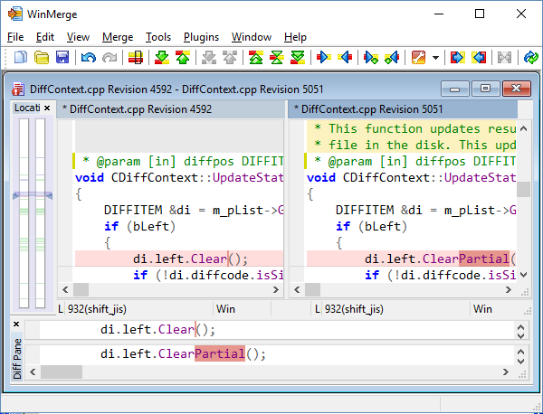

<link href="./Github_GreyMerlin.css" rel="stylesheet"></link>

Quick start
----

### 1. Selecting files and folders to compare

After you have installed WinMerge, step through the procedure and discussions in this topic to learn basic WinMerge operations and concepts. The methods shown are not the only ways to do things: there are usually several ways to do each task. When you are done, you can go on to learn
other methods and more advanced skills, which are covered in other help topics.

1. Open the WinMerge window. Here are some of the methods you can use:
     - Double-click the WinMerge desktop shortcut.
     - Navigate to the WinMerge launcher in your Start menu.
     - In a Command Prompt window, cd to the WinMerge installation folder and enter **WinMergeU**
 
2. In the WinMerge window select the files or folders that you want to operate on. For example:
      - Click *File &rarr; Open*.
      - Click the  WinMerge open button.
      - Press **Ctrl+O**.  

      The Select Files or Folders dialog opens:

      

3. In the *1st* and *2nd* fields, specify the files and folders to compare. Use any of these         methods:

      - Enter the path names directly into the fields.</para>
      - Click the **Browse** button to navigate to the desired path.

      - In the Open dialog, the text, `Folder Selection`, is initially displayed in the *File name* field. Your selection depends on the type of comparison you want to do:

          - If you are comparing files, select the target file. The `Folder Selection` text is overwritten with your selection.
          - If you are comparing folders, open the target folder; do not select a file. The `Folder Selection` text remains in place.

          Click **Open** to dismiss the Open dialog and load your selection in the *1st* or              *2nd* field. If you specified folders, the field includes a backslash ( \ ) at end of the path.

      - Click the combo box and choose a previously-used path.

        >  **Tip**   To make it easier to select frequently-used paths, consider enabling the *Open-dialog Auto-completion* option. With this option, WinMerge shows a list of paths available as you type in the fields. See [Options and Configuration](./Configuration.md) for details.

      - Drag and drop a file or folder into the dialog or the *1st* or *2nd* field.

        >  **Note**   You can select only one pair of files or one pair of folders to compare. If you select a file and a folder or if one of the files or folders is not found, WinMerge disables the **OK** button in the dialog.  
        The status message at the bottom of the dialog also informs you if one of the paths is invalid.

4. If you are comparing folders, you can use the *Filter* field to eliminate some files from the operation. The field specifies a subset of files in the selected paths that are to be included; all unspecified files are excluded.

      You can enter file masks to filter files with certain extensions.  For example, this expression includes only C and C++ source files; all other file types are eliminated from your selection.

      `*.cpp;*.hpp;*.c;*.h`

      For more robust filtering, enter a filter file instead of file masks: click the Select button next to the *Filters* field to choose from a list of available filters. File filters contain any number of rules to either include or exclude files. WinMerge installs a set of filter files, which you can edit or augment with your own files.

      See [Using Filters](./Filters.md) for full details about file masks and filter files.

5. The *Include Subfolders* check box provides another way to control the scope of folder comparisons. If you check this option, WinMerge recursively compares subfolders, and shows all the files and folders it finds in one view. If you disable the option, only the current folder is compared, and subfolders are listed by name (without their contents), so you can browse into them.

6. The Unpacker field enables you to perform compare operations on plug-ins.

#### 1.1 Other ways to open files and folders<indexterm>

   The Select Files or Folders dialog is the main interface for opening files and folders. But you can use many other ways, too:

   - [Project Files](OpenPaths_project) are the easiest and fastest way to open frequently used paths. To open a project file, use one of these methods:

       - From the WinMerge window, click *File &rarr; Open Project*.

       - From a command line.

       - From the Opening Files and Folders dialog, specify a project file in the *1st* field.

         >  **NOTE**   If you specify project files in both the  *1st* and *2nd* fields,  WinMerge does not open either project file; it simply compares the XML content of the two files.

       - [Launching WinMerge operations in Windows Explorer](./Open_paths.md)

       - Use the [Command Line](./Command_line) interface to start WinMerge from other applications, from a command prompt, or a batch or script file.

       - Drag and drop files and folders directly into the WinMerge window or on the WinMerge desktop shortcut.
 
## 2. Comparing folders

If you selected two folders in the Open dialog, the Folder Compare window is opened. The Folder Compare window is a tabular list of items found in the compared folders. Each row displays information about a found file, with the file name in the left column and additional information in the other columns:

 WinMerge does not have a concept of *original* and *changed* sides. Instead, it simply shows what is different between two selected folders. A file or folder that is found only on one side is simply shown as a unique item on that side, not as added or removed. For example, in the *Comparison result* column of the preceding figure, `Merge.aps` and `Merge.rc.bak` are each found in only one of the compared folders.

You can manage files and folders in many ways using the *Merge* menu, toolbar buttons, or context (right-click) menu. The most important action is making files or folders identical in both sides by selecting one of several Copy items. When you copy a file or folder to other side, the Comparison result value changes to `Identical`.

If a file or folder exists in both sides (and it is not a binary file) it can be opened for file comparison using one of these methods:

   - Click *Compare &rarr; Merge* in the WinMerge menu.

   - Right-click the row and choose the *Compare* shortcut.

   - Double-click the row.

   - Select the row and press **Enter**.

If you compare a subfolder, the new folder's comparison table is loaded in the current Folder Compare window . When you are done with that folder's comparison, you can navigate back to its parent folder by double-clicking the  up arrow at the top of the Filename column.

If you compare a file, WinMerge opens the File Compare window, described in the next section. If you change a file in the File Compare window, and then return to the Folder Compare window, you will see the file's data is updated there.

## 3. Comparing files

The File Compare window shows the two selected files side by side, in separate File panes. Different lines are highlighted with a background color. One or more consecutive different lines form one difference (or *diff*). In the preceding example, a single difference is selected in the File panes and displayed by itself in the Diff Pane. WinMerge mainly works with these differences, not separate lines. When you merge a difference, you copy all of its lines from one side to the other.

>  &nbsp; **Important**   Notice how WinMerge fills missing lines, so that similar lines are always aligned vertically, side by side. This is different from most other compare/merge programs, and can take a while to learn.

WinMerge has a simple integrated editor that features basic typing, copying, cutting and pasting of text. If *Automatic rescan* is enabled, WinMerge updates file differences while you edit a file. If *Automatic rescan* is disabled, you can update files by selecting *Edit &rarr; Refresh*, clicking the  toolbar button, or pressing **F5**
    
    